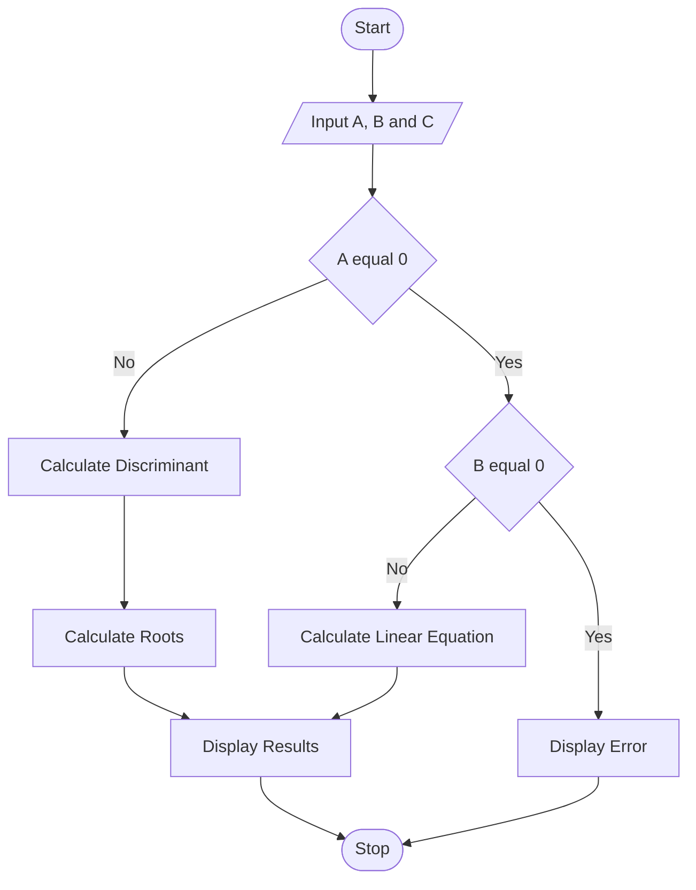

```mermaid
graph TD
  A([Start]) --> B(Get Coefficients)
  B[/Input A, B and C/] --> C{A equal 0}
  C -- No --> D[Calculate Discriminant]
  D --> E[Calculate Roots]
  E --> F[Display Results] --> J
  C -- Yes --> G{B equal 0}
  G -- Yes --> H[Display Error] --> J
  G -- No --> I
  I[Calculate Linear Equation] --> F
  J([Stop])
```