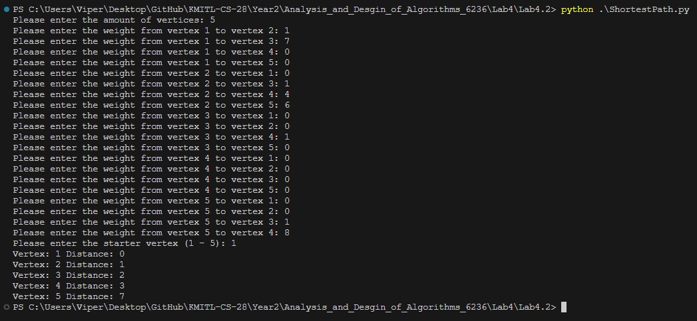

<div align="center">
    <h1>🛣️Shortest Path🛣️</h1>
    
</div>

## 📖 คำอธิบาย

โปรแกรมนี้เป็นโปรแกรมที่ใช้ในการหา Shortest Path โดยใช้ Algorithm ของ Dijkstra's Algorithm

### 1. ⌨ การรับข้อมูล Vertex จาก User

โปรแกรมจะทำการให้ User Input ค่าที่จำเป็นต่างๆ เช่น จำนวน Vertex ทั้งหมดที่มีใน Graph, Weight ของ Edges ทั้งหมดภายใน Graph และอย่างสุดท้ายคือ Vertex เริ่มต้น

- **Function `get_integer_input`**: 
    ฟังก์ชั่นนี้เป็นฟังก์ชั่นที่ใช้ในการรับข้อมูลตัวเลขจาก User โดยจะมีการเช็คว่าค่าที่ User นั้นใส่มามีความถูกต้องหรือไม่ โดยการเช็คดังนี้:
    1) ข้อมูลที่ใส่มานั้นเป็นตัวเลขหรือไม่ 
    2) ค่าที่ใส่มานั้นมีค่าอยู่ในขอบเขตของ lower_bound หรือ higher_bound หรือไม่

    <br/>**⚠️โดยถ้ามีการใส่ช้อมูลไม่ถูกต้องจะแจ้งเตือน User แล้วให้ User ทำการใส่ค่าใหม่จนกว่าจะถูกต้อง⚠️**

```py
def get_integer_input(prompt, lower_bound=None, higher_bound=None):
    while True:
        try:
            value = int(input(prompt))
            if (lower_bound is None and higher_bound is None) or (value >= lower_bound and value <= higher_bound):
                return value
            else:
                if value < lower_bound:
                    print(f"Value must be greater than or equal to {lower_bound}")
                else:
                    print(f"Value must be lower than or equal to {higher_bound}")
        except ValueError:
            print("Invalid input. Please enter an integer.")
```

### 2. 👨🏻‍💻 การหา Shortest Path

เราจะทำการหา Shortest Path ด้วยวิธีการใช้ Dijkstra's Algorithm โดยมีส่วนสำคัญดังนี้

- **Function `shortest_path`**:
  ฟังก์ชั่นนี้จะทำการหา Shortest Path โดยใช้ Dijkstra's Algorithm หลักการทำงานคือฟังก์ชั่นจะรับค่า Parameter sourceIndex คือ Vertex เริ่มต้น และ weightData คือ ค่าของ Weight แต่ละจุด<br/>
    จากนั้นจะทำการคำนวณโดยการสร้าง List ที่เก็บค่าตัวเลข โดยให้ค่าเริ่มต้นเป็น inf จำนวนตาม Vertex ทั้งหมด และ List ที่เก็บค่า Boolean โดยให้เริ่มต้นเป็น False จำนวนตาม Vertex ทั้งหมด และ ทำการเปลี่ยนค่าของ dist ตำแหน่ง sourceIndex ให้มีค่าเป็น 0<br/>
    จากนั้นวนลูปตามจำนวน Vertex ทั้งหมดโดยมีตัวแปรเป็น i โดยในแต่ละรอบจะทำการหาตำแหน่งของ Weight ที่น้อยที่สุดโดยให้เป็นตัวแปร minimumIndex และทำการปรับค่า visitedData ตำแหน่งที่ i ให้เป็นค่า True ว่าเคยมาจุดนี้แล้ว<br/>
    จากนั้นจะวนลูปตามจำนวน Vertex ทั้งหมดอีกครั้ง ครั้งนี้ให้เป็นตัวแปร j โดยในลูปแต่ละรอบจะทำการเช็คเงื่อนไขดังนี้:
    1) visitedData ตำแหน่งที่ j นั้นมีค่าเป็น False แปลว่ายังไม่เคยมาใช่มั้ย 
    2) ค่า Weight ของ weightData[minimumIndex][j] นั้นต้องไม่มีค่าเป็น 0 
    3) ต้อง dist ตำแหน่งที่ minimumIndex บวกกับ ค่า Weight จาก weightData[minimumIndex][j] ต้องมีค่าน้อยกว่า dist ตำแหน่งที่ j

    ถ้าเข้าเงื่อนไขข้างต้นจะทำการเปลี่ยนค่าของ dist ตำแหน่งที่ j ให้มีค่าเป็น dist ตำแหน่งที่ minimumIndex บวกกับค่า Weight จาก weightData[minimumIndex][j]<br/>
เมื่อทำการวนลูป i เสร็จสิ้นจะทำการส่งค่า dist กลับไป

```py
def shortest_path(sourceIndex, weightData):
    dist = [float('inf') for i in range(len(weightData))]
    visitedData = [False for i in range(len(weightData))]
    dist[sourceIndex] = 0

    for i in range(len(weightData)):
        minimumIndex = find_minimum_distance(dist, visitedData)
        visitedData[minimumIndex] = True

        for j in range(len(weightData)):
            if visitedData[j] == False and weightData[minimumIndex][j] != 0 and dist[minimumIndex] + weightData[minimumIndex][j] < dist[j]:
                dist[j] = dist[minimumIndex] + weightData[minimumIndex][j]

    return dist
```

- **Function `find_minimum_distance`**:
    หาค่า Weight ที่น้อยที่สุดใน List โดยจะทำการรับ Parameter List 2 ตัวก็คือ dist กับ visitedData เมื่อรับเข้ามาแล้วจะทำการ กำหนดให้ตัวแปร min นั้นมีค่าเป็น inf และตัวแปร currentIndex มีค่าเป็น -1
    จากนั้นจะทำการวนลูปตามจำนวนของ Vertex ทั้งหมดโดยในลูปแต่ละรอบนั้นจะทำการเช็คเงื่อนไขดังนี้

    1) visitedData ตำแหน่งที่ i ต้องมีค่าไม่เป็น True
    2) dist ตำแหน่งที่ i ต้องมีค่าน้อยกว่าหรือเท่ากับ min

    <br/>ถ้าเข้าเงื่อนไขข้างต้นจะทำการเปลี่ยนค่า min ให้มีค่าเป็น dist ตำแหน่งที่ i และเปลี่ยนค่า currentIndex ให้มีค่าเป็น i<br/>
    เมื่อวนลูปครบแล้วจะทำการส่งค่า currentIndex กลับไป

```py
def find_minimum_distance(dist, visitedData):
    min = float('inf')
    currentIndex = -1

    for i in range(len(dist)):
        if visitedData[i] != True and dist[i] <= min:
            min = dist[i]
            currentIndex = i

    return currentIndex
```

### 4. 🚩 การทำงานของโปรแกรม

- **Function `main`**:
    เมื่อ Run โปรแกรมแล้วโปรแกรมจะเรียกใช้ฟังก์ชั่น main เป็นอันดับแรกโดยในส่วน main จะทำหน้าที่ในการเรียกใช้ฟังก์ชั่นรับค่าต่างๆจาก User และทำการส่งข้อมูลที่ได้รับมาจาก User เข้าไปหาคำตอบ Shortest Paht เมื่อได้รับคำตอบแล้วจะแสดงผลออกมาใน Terminal

```py
def main():
    verticesAmount = get_integer_input("Please enter the amount of vertices: ", 1, float('inf'))
    weightData = [[] for i in range(verticesAmount)]

    for i in range(verticesAmount):
        for j in range(verticesAmount):
            if i == j:
                weightData[i].append(0)
            else:
                weight = get_integer_input(f"Please enter the weight from vertex {i+1} to vertex {j+1}: ")
                weightData[i].append(weight)

    startedVertex = get_integer_input(f"Please enter the starter vertex (1 - {verticesAmount}): ", 1, verticesAmount)
    result = shortest_path(startedVertex - 1, weightData)

    for k in range(len(result)):
        print(f"Vertex: {k + 1} Distance: {result[k]}")

if __name__ == "__main__":
    main()
```