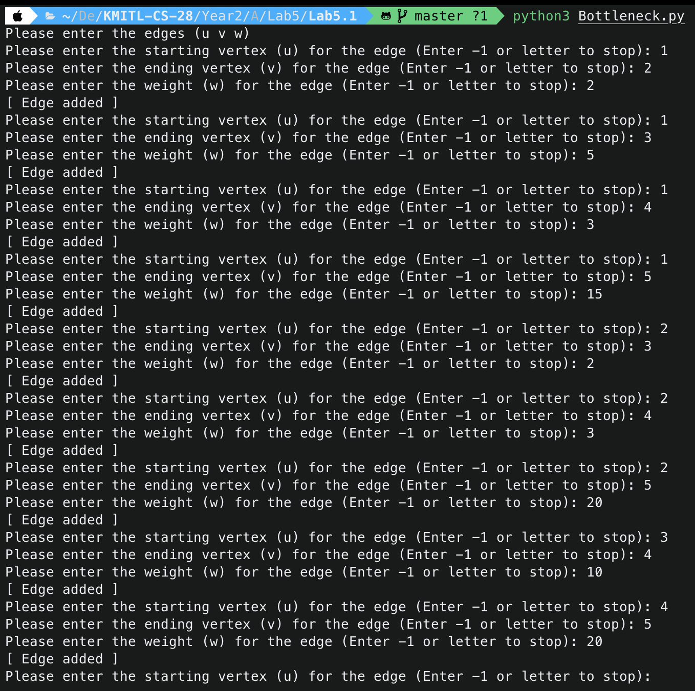
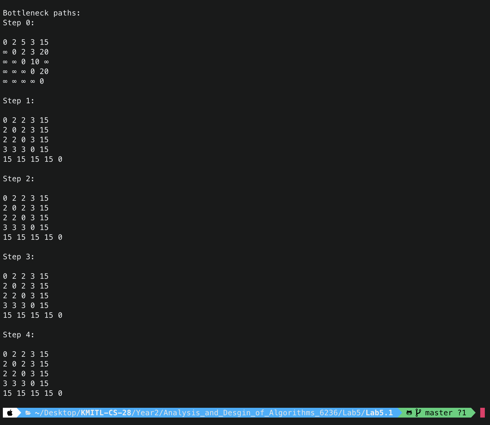

<div align="center">
    <h1>BottleNeck Path</h1>
    <sub>โปรแกรมสำหรับหา BootleNect Path</sub>
    
    
</div>

## 📖 Description

โปรแกรมนี้เป็นโปรแกรมที่ใช้ในการหาทางที่มีความแคบที่สุดในเครือข่าย โดยโปรแกรมจะรับข้อมูลเข้ามาเป็นรูปแบบของเครือข่าย และจะแสดงผลลัพธ์ออกมาเป็นทางที่มีความแคบที่สุดในเครือข่าย

### 1) สร้าง Graph

โปรแกรมจะทำการสร้างโครงสร้าง Graph เพื่อแทนการเชื่อมต่อระหว่างจุดที่ต่างกัน

- โดยเราจะสร้าง Class ที่มีชื่อว่า Graph มา โดยที่ข้อมูลของ Class นี้ประกอบไปด้วยจำนวนจุดที่เชื่อมโยง (V) และ List เพื่อแทนการเชื่อมต่อระหว่างจุด (Edges)
</br>

- Function ที่ใช้ในการสร้าง Graph

```python
def __init__(self):
    self.V = 0 # จำนวนจุดที่เชื่อมโยง
    self.Edges = [] # List เก็บ Edge
```

- Function ที่ใช้ในการเพิ่มจุดใน Graph

```python
def add_edge(self, u, v, w):
    self.Edges.append([u, v, w]) # เพิ่มข้อมูลลงไปใน Edges
    self.V = max(self.V, u, v) # เปลี่ยนค่าจำนวนจุดที่เชื่อมโยงให้มีค่ามากที่สุด
```

### 2) หาทางที่มีความแคบที่สุด

โปรแกรมจะทำการหาทางที่มีความแคบที่สุดโดยจะทำการหาทางที่มีความแคบที่สุดโดยการเปรียบเทียบระยะทางระหว่างจุดที่เชื่อมโยงกันและจุดที่เชื่อมโยงกับจุดอื่นๆ โดยจะเปรียบเทียบระยะทางระหว่างจุดที่เชื่อมโยงกันและจุดที่เชื่อมโยงกับจุดอื่นๆ และเลือกค่าที่มีค่าน้อยที่สุด

```python
def bottle_neck_path(g, distances):
    for k in range(1, g.V+1):
        for i in range(1, g.V+1):
            for j in range(1, g.V+1):
                tmp = min(distances[i][j], max(distances[i][k], distances[k][j]))
                distances[i][j] = tmp
                distances[j][i] = tmp
    return distances
```

### 3) แสดงผลลัพธ์

โปรแกรมจะแสดงผลลัพธ์ออกมาเป็นทางที่มีความแคบที่สุดในเครือข่ายทีละขั้นตอน

- Function ที่ใช้ในการแสดง Matrix

```python
def display_matrix(matrix, step):
    print(f"Step {step}:\n")
    for i in range(1, len(matrix)):
        for j in range(1, len(matrix[i])):
            if matrix[i][j] == inf:
                print("∞", end=" ")
            else:
                print(matrix[i][j], end=" ")
        print()
    print()
```

### 4) รับข้อมูลเข้ามาจาก User

โปรแกรมจะรับข้อมูลเข้ามาเป็นรูปแบบของเครือข่าย โดยจะรับข้อมูลเข้ามาเป็นจำนวนของจุดที่เชื่อมโยงกันและจะรับข้อมูลเข้ามาเป็นจำนวนของจุดที่เชื่อมโยงกันและระยะทางระหว่างจุดที่เชื่อมโยงกัน

- Function ที่ใช้ในการดักจับ Error เวลา User ป้อนข้อมูลที่ไม่ใช่ตัวเลข

```python
def get_user_input(prompt):
    while True:
        try:
            input_value = int(input(prompt))
            return input_value
        except ValueError:
            return False
```

- Function ในการสร้าง Graph โดยรับค่า Input ต่างๆที่จำเป็นจาก User มาโดยจะเรียกใช้ Function get_user_input เพื่อให้ User กรอกเป็นตัวเลขดักจับ Error ถ้า User กรอกข้อมูลไม่ถูก

```python
def main():
    g = Graph()

    print("Please enter the edges (u v w)")

    while True:
        u = get_user_input("Please enter the starting vertex (u) for the edge (Enter -1 or letter to stop): ")
        if u == -1 or u == False:
            break

        v = get_user_input("Please enter the ending vertex (v) for the edge (Enter -1 or letter to stop): ")
        if v == -1 or u == False:
            break

        w = get_user_input("Please enter the weight (w) for the edge (Enter -1 or letter to stop): ")
        if w == -1 or u == False:
            break

        g.add_edge(u, v, w)
        print("[ Edge added ]")

    distances = [[inf for _ in range(g.V+1)] for _ in range(g.V+1)]

    for i in range(1, g.V+1):
        for j in range(1, g.V+1):
            if i == j:
                distances[i][j] = 0

    for edge in g.Edges:
        distances[edge[0]][edge[1]] = edge[2]

    print("\nBottleneck paths:")

    for k in range(g.V):
        display_matrix(distances, k)
        distances = bottle_neck_path(g, distances)
```

## 📝 Pseudocode

```plaintext
class Graph:
    def __init__(self):
        สร้างโครงสร้าง Graph ใหม่โดยมีข้อมูล จำนวนจุดที่เชื่อมโยง และ List เก็บ Edges ต่างๆ

    def add_edge(self, u, v, w):
        เพิ่มค่า List ที่มีค่า [u v w] เพิ่มลงไปใน Edges
        เปลี่ยนค่า V ให้มีค่าเป็นค่าที่มากที่สุดใน 3 ค่านี้ [self.V, u, v]

def bottle_neck_path(g, distances):
    สร้างลูปโดยวนค่าตั้งแต่ 1 ถึงค่าจำนวนจุดที่เชื่อมโยง + 1 โดยให้มีการเก็บค่ารอบที่วนในตัวแปร k
        สร้างลูปโดยวนค่าตั้งแต่ 1 ถึงค่าจำนวนจุดที่เชื่อมโยง + 1 โดยให้มีการเก็บค่ารอบที่วนในตัวแปร i
            สร้างลูปโดยวนค่าตั้งแต่ 1 ถึงค่าจำนวนจุดที่เชื่อมโยง + 1 โดยให้มีการเก็บค่ารอบที่วนในตัวแปร j
                เก็บค่าที่ตํ่าที่สุดใน 3 ค่า (distance[i][j], max(distance[i][k], distance[k][j]) ในตัวแปร tmp
                เปลี่ยนค่า distance[i][j] ให้มีค่าเป็น tmp
                เปลี่ยนค่า distance[j][i] ให้มีค่าเป็น tmp
    ส่งค่า distances กลับไป

def get_user_input(prompt):
    วนลูปไปเรื่อยๆ
        ลอง Code ในนี้:
            รับค่า input และเปลี่ยนค่าให้เป็น int โดยกำหนดให้มีตัวแปรชื่อ input_value
            ส่งค่า input_value กลับไป
        ถ้า Code ที่ลองข้างบนเกิดมีการ Error จากใส่ข้อมูลผิดจะทำข้างในนี้:
            ส่งค่า False กลับไป

def display_matrix(matrix, step):
    แสดงข้อความ "Step {step}:\n"
    สร้างลูปที่มีการเก็บค่ารอบในตัวแปร i โดยให้มีการวนตั้งแต่ 1 ไปถึงจำนวนขนาดของ matrix
        สร้างลูปที่มีการเก็บค่ารอบในตัวแปร j โดยให้มีการวนตั้งแต่ 1 ไปถึงจำนวนขนาดของ matrix
            ถ้า matrix[i][j] มีค่าเป็น inf ให้ทำการแสดง "∞" 
            ถ้าเงื่อนไขแรกไม่เป็นจริงให้ทำการแสดง matrix[i][j]

def main():
    สร้าง Graph เริ่มต้นให้เก็บอยู่ใน g


    แสดงข้อความ "Please enter the edges (u v w)"

    วนลูปไม่มีวันสิ้นสุด:
        รับค่าจาก User ให้เก็บอยู่ในตัวแปร u
        ถ้า u มีค่าเป็น -1 หรือ u มีค่าเป็น False ให้ทำการหยุดลูป

        รับค่าจาก User ให้เก็บอยู่ในตัวแปร v
        ถ้า v มีค่าเป็น -1 หรือ u มีค่าเป็น False ให้ทำการหยุดลูป

        รับค่าจาก User ให้เก็บอยู่ในตัวแปร w
        ถ้า w มีค่าเป็น -1 หรือ u มีค่าเป็น False ให้ทำการหยุดลูป

        เพิ่มจุดลงใน Graph โดยใส่ค่า u, v, w
        แสดงข้อความ "[ Edge added ]"

    กำหนดให้ตัวแปร distance มีค่าเป็น List 2 มิติตามจำนวน g.V + 1 และให้มีค่าใน List ทั้ง 2 เป็น inf

    วนลูปจาก 1 ถึง g.V + 1 โดยให้มีตัวแปรเก็บรอบปัจจุบันเป็น i
        วนลูปจาก 1 ถึง g.V + 1 โดยให้มีตัวแปรเก็บรอบปัจจุบันเป็น j
            ถ้า i มีค่าเท่ากับ j ให้เปลี่ยนค่า distance[i][j] มีค่าเป็น 0

    วนลูปดึงค่าจาก g.Edges ทีละตัวโดยเป็นตัวแปร edge
        เปลี่ยนค่า distance[edge ตำแหน่งที่ 0][edge ตำแหน่งที่ 1] ให้มีค่าเป็น edge ตำแหน่งที่ 2

    แสดงข้อความ "\nBottleneck paths:"

    วนลูปตั้งแต่ 0 ถึง g.V รอบโดยมีการเก็บค่ารอบปัจจุบันในตัวแปร k
        แสดง Matrix
        เปลี่ยนค่า distance ให้มีค่าเป็นค่าที่ bottle_nect_path(g, distances) ส่งกลับมา
```