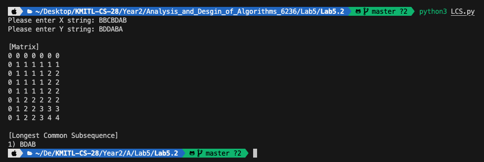

<div align="center">
    <h1>Longest Common Subsequence</h1>
    <sub>โปรแกรมสำหรับหา Longest Common Subsequence</sub>
    
</div>

## 📖 Description

โปรแกรมนี้เป็นโปรแกรมสำหรับหา Longest Common Subsequence ที่เป็นไปได้ทั้งหมดจาก X และ Y ที่ Users ใส่เข้ามา

### 1) สร้าง Matrix

โปรแกรมจะทำการสร้าง Matrix เพื่อคำนวณหา LCS

- Function ที่ใช้ในการสร้าง Matrix LCS

```python
def LCS(X, Y):
    matrix = [[] for _ in range(len(X) + 1)]
 
    for i in range(len(X) + 1):
        for j in range(len(Y) + 1):
            if i == 0 or j == 0:
                matrix[i].append(0)
            else:
                if Y[j - 1] == X[i - 1]:
                    matrix[i].append(matrix[i - 1][j - 1] + 1)
                else:
                    matrix[i].append(max(matrix[i - 1][j], matrix[i][j - 1]))

    return matrix
```

### 2) หา LCS ที่เป็นไปได้

- โปรแกรมจะทำการคำนวณหา LCS ที่เป็นไปได้จาก Matrix ที่ใส่เข้ามาและคำนวณโดยการย้อนกลับโดยใช้หลักการ Recursive

```python
def findLCS(X, Y, matrix):
    def findLCSHelper(i, j):
        if i == 0 or j == 0:
            return [""]
        if X[i - 1] == Y[j - 1]:
            lcs = findLCSHelper(i - 1, j - 1)
            return [x + X[i - 1] for x in lcs]
        else:
            lcs = []
            if matrix[i][j] == matrix[i - 1][j]:
                lcs.extend(findLCSHelper(i - 1, j))
            if matrix[i][j] == matrix[i][j - 1]:
                lcs.extend(findLCSHelper(i, j - 1))
            return lcs

    return findLCSHelper(len(X), len(Y))
```

### 3) แสดง Matrix

- โปรแกรมจะแสดงหน้าตาของ Matrix ก่อนคำนวณหา LCS ที่เป็นไปได้

```python
def displayMatrix(matrix):
    for i in range(8):
        for j in range(7):
            print(matrix[i][j], end=" ")
        print()
```

### 4) Main

- เป็นส่วนของโปรแกรมหลักที่เรียกให้ Users ป้อน Input และเรียกใช้ Function ในการคำนวณอื่นๆต่อไปจากนั้นแสดงคำตอบ

```python
def main():
    X = input("Please enter X string: ")
    Y = input("Please enter Y string: ")

    matrix = LCS(X, Y)
    lcs_list = list(set(findLCS(X, Y, matrix)))
    
    print("\n[Matrix]")
    displayMatrix(matrix)

    print("\n[Longest Common Subsequence]")
    for i in range(len(lcs_list)):
        print(f"{i+1}) {lcs_list[i]}")
```

## 📝 Pseudocode

```plaintext
ฟังก์ชัน displayMatrix(เมทริกซ์)
    วนซ้ำ i จาก 0 ถึง 7
        วนซ้ำ j จาก 0 ถึง 6
            พิมพ์ เมทริกซ์[i][j] ตามด้วยช่องว่าง
        พิมพ์บรรทัดใหม่

ฟังก์ชัน LCS(X, Y)
    สร้างเมทริกซ์ว่าง ขนาด (len(X) + 1) แถว

    วนซ้ำ i จาก 0 ถึง len(X)
        วนซ้ำ j จาก 0 ถึง len(Y)
            ถ้า i หรือ j เป็น 0
                เพิ่ม 0 ในเมทริกซ์[i]
            ถ้าไม่ใช่
                ถ้า Y[j - 1] เท่ากับ X[i - 1]
                    เพิ่ม (เมทริกซ์[i - 1][j - 1] + 1) ในเมทริกซ์[i]
                ถ้าไม่ใช่
                    เพิ่ม max(เมทริกซ์[i - 1][j], เมทริกซ์[i][j - 1]) ในเมทริกซ์[i]
    
    คืนค่าเมทริกซ์

ฟังก์ชัน findLCS(X, Y, เมทริกซ์)
    ฟังก์ชัน findLCSHelper(i, j)
        ถ้า i หรือ j เป็น 0
            คืนค่า [""]
        ถ้า X[i - 1] เท่ากับ Y[j - 1]
            lcs = findLCSHelper(i - 1, j - 1)
            คืนค่า [x + X[i - 1] สำหรับ x ใน lcs]
        ถ้าไม่ใช่
            สร้างลิสต์ lcs ว่าง

            ถ้าเมทริกซ์[i][j] เท่ากับ เมทริกซ์[i - 1][j]
                lcs.เพิ่ม(findLCSHelper(i - 1, j))
            ถ้าเมทริกซ์[i][j] เท่ากับ เมทริกซ์[i][j - 1]
                lcs.เพิ่ม(findLCSHelper(i, j - 1))
            
            คืนค่า lcs

    คืนค่า findLCSHelper(len(X), len(Y))

ฟังก์ชัน main()
    X = รับข้อมูลป้อนเข้า
    Y = รับข้อมูลป้อนเข้า

    เมทริกซ์ = LCS(X, Y)
    lcs_list = แปลงเป็นลิสต์(กำจัดซ้ำ(findLCS(X, Y, เมทริกซ์)))
    
    พิมพ์ "\n[เมทริกซ์]"
    displayMatrix(เมทริกซ์)

    พิมพ์ "\n[ลำดับร่วมที่ยาวที่สุด]"
    วนซ้ำ i จาก 0 ถึง len(lcs_list) - 1
        พิมพ์ f"{i+1}) {lcs_list[i]}"

ถ้า __name__ == "__main__"
    main()
```